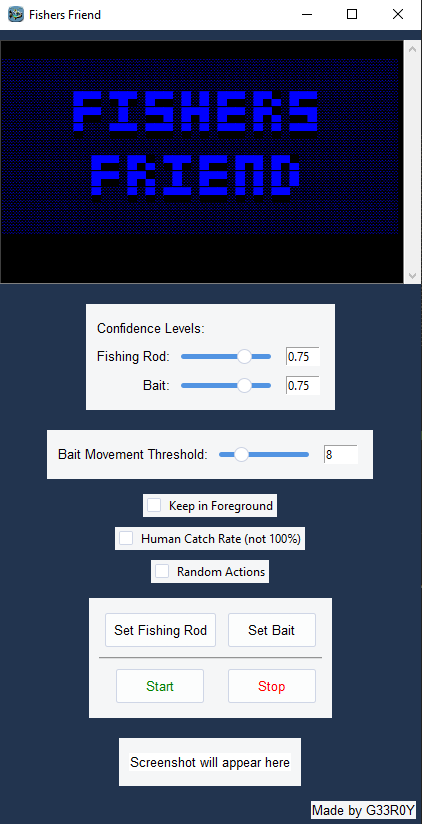

# Fishers Friend


Fishers Friend is an automation script designed to catch fish in World of Warcraft. The script utilizes the `pyautogui` library to simulate keyboard presses and the `Tkinter` library for the graphical user interface (GUI). The main features include setting confidence levels, adjusting bait movement thresholds, enabling random actions, and providing visual feedback through a console.

## Features

### Human Mousemovement
The Script uses a library for generating human-like mouse movements. The movements are based on the concept of bezier curve: https://en.wikipedia.org/wiki/B%C3%A9zier_curve

### Confidence Levels
The script allows users to set confidence levels for the image recognition of the fishing rod or bait. The confidence levels are adjustable through sliders or value boxes in the GUI.

### Bait Movement Threshold
Users can set the threshold for bait movement (in pixel) for how much the bait can move without triggering the Right-Click to catch the fish, using the slider or value box.

### Keep in Foreground
The "Keep in Foreground" checkbox allows the user to toggle whether the main window should stay on top of other windows.

### Human Reaction Time
The "Human Catch Rate" checkbox introduces variability in the delay before the Right-Click, simulating a more human-like reaction time.

### Random Actions
Enabling the "Random Actions" checkbox triggers the script to perform random in-game actions, such as opening the bag, map, jumping, or moving left and right.


## Dependencies
### GUI library
- `tk`
### Additional GUI components
- `ttkthemes`
- `Pillow`
### Utility libraries
- `pyautogui`
- `numpy`
- `pytweening`
- `opencv-python`

## Installation & How to Run

1. Ensure Python is installed on your system.
2. Download the Repository
3. Unzip Folder and switch into the created 'FishersFriend' folder
4. Open a Terminal(cmd) in the 'FishersFriend' folder and run:
   ```
   pip install -r requirements.txt
   ```
5. Now you can double-click the FishersFriend.py or run it from your IDE


## Usage
1. **Set Fishing Rod:**
   - If clicked a Screenshot gets taken and you can mark the Icon of the Fishing Rod in the taken Screenshot and confirm it to set it as the Image which should be found.
2. **Set Bait:**
   - If clicked a Screenshot gets taken and you can mark the the Bait (recommending only the inside of the feathers) in the taken Screenshot and confirm it to set it as the Image which should be found.

     Bait Example:

     

1. **Set Confidence Levels:**
   - Adjust confidence levels for the fishing rod and bait image recognition using the provided sliders or value boxes.
   
   (Recommending to start with default values and adjust if needed)

2. **Set Bait Movement Threshold:**
   - Set the threshold for bait movement (in pixel) for how much the bait can move without triggering the Right-Click to catch the fish, using the slider or value box.

   (Recommending to start with default values and adjust if needed)
   
4. **Keep in Foreground:**
   - Toggle the "Keep in Foreground" checkbox to keep program in foreground.

5. **Human Reaction Time:**
   - Toggle the "Human Catch Rate" checkbox to make the bot miss some fishes.
   - (gets accomplished by setting a random delay between 1-5 seconds before the Right-Click)
   - If delay is over 4s the fish will get away
   - IF BUTTON IS NOT CHECKED: The delay is between 1-3 seconds which is still a realistic human reaction time

6. **Random Actions:**
   - Enable the "Random Actions" checkbox to perform random in-game actions between the main catching loop (random after 1-15 catching loops).
   - For Example:
      - Open/Close Map or Bag
      - Move Right/Left and back to original position

7. **Start/Stop:**
   - Click the "Start" button to begin the script execution, and use the "Stop" button to halt the execution.


## Important Notes
 - Adjustments to confidence levels, thresholds, and checkboxes should be made before starting the script.

## Third-Party Code and Licenses

This project includes code from [pyclick](https://github.com/patrikoss/pyclick) which is licensed under the MIT License. The original copyright notice and license text can be found in the [LICENSE](LICENSE) file.
I had to modify the `humancurve.py` and `_beziercurve.py` so that the given values from my function are getting converted to integers.

## Author
 - Made by G33R0Y

Feel free to explore and modify the script according to your needs. *Happy fishing!*
